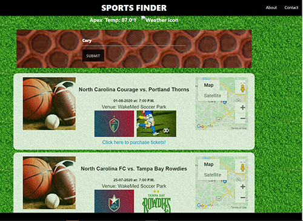

# Finder-Project1

   

# Links to deployed application and repository:
* [Deployed Application](https://mrbusiness87.github.io/Finder-Project1/index.html)
* [Repository](https://github.com/MrBusiness87/Finder-Project1)

# Project Name: Finder-Project1
# Title: Sports Finder

# Introduction:   
Create a sports finder application in a group that allows the user to enter the City to display sports events near city

# Technologies: 
HTML, CSS, Javascript, AJAX, jquery, Materialize, Openweathermap and Ticket master APIs

# Features
Created the following 
html files: 
  * index.html, about.html, contact.html
js files: 
  * script.js
css files
  * style.css

Developed the site with the following features:

  * Used two server-side APIs - Openweathermap and Ticketmaster
  * Used one third-party API - materialize.min.js
  * Interactive app which accepts user input 
  * Displays sports events with date, time, venue, and map of the sports event in the same page when the user enters a city in the search box
  * User can purchase tickets using the provided link in the sports event details
  * Display weather of the city that the user entered
  

Used HTML validation service to ensure that each page has valid HTML.

# Launch

Launch [Deployed Application](https://mrbusiness87.github.io/Finder-Project1/index.html) to view the page. 
